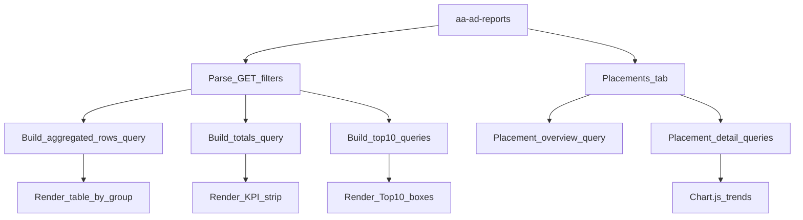

# Placement-aware Reports v1 + Placements Drilldown

## Context (current code)

- Reports UI and current query live in [includes/admin-reports.php](d:\development\agile-alliance-ad-manager\includes\admin-reports.php) (`aa_ad_manager_display_reports()`, `aa_ad_manager_display_client_reports()`, `aa_ad_manager_get_ad_report_data()`).
- Tracking tables already include `placement_key` and timestamps in [includes/db.php](d:\development\agile-alliance-ad-manager\includes\db.php) (`aa_ad_impressions.placement_key/impressed_at`, `aa_ad_clicks.placement_key/clicked_at`).
- Admin CSS is already enqueued on `page=aa-ad-reports` in [includes/admin-options.php](d:\development\agile-alliance-ad-manager\includes\admin-options.php) (`aa_ad_manager_enqueue_admin_assets()`).
- Chart.js is already bundled and enqueued for the aa_ads “Performance” tab only via [includes/cpt.php](d:\development\agile-alliance-ad-manager\includes\cpt.php) (`aa_ad_manager_enqueue_admin_scripts()`), so the Reports page will need its own conditional enqueue for any charts.

## Target UX (Reports → Client Reports)

- Add filter controls:
  - Date range: `7/30/90/all` (default `all` unless existing behavior implies otherwise)
  - Placement: All / “(none / legacy)” (= empty string) / known placement keys
  - Group by: **Ad + Page (default)** / Placement + Ad / Placement only
- Add KPI summary strip (imps, clicks, CTR, distinct ads, distinct placements).
- Add “Top 10” widgets (placements by imps, placements by clicks, ads by clicks, pages by clicks) using the same filter set.
- CSV export must match **the same filters + grouping** as the visible table.

## Phase 2 (Reports → Placements tab)

- Add a third tab under the existing Reports page:
  - `?post_type=aa_ads&page=aa-ad-reports&tab=placements`
- Placements overview table (within chosen range + optional client/campaign filters):
  - Placement, Impressions, Clicks, CTR, Distinct pages, Distinct ads
- Drilldown view (same tab) for a selected placement:
  - Trends over time (impressions/clicks/CTR) via Chart.js
  - Top Ads in placement
  - Top Pages in placement

## Data/query approach (fast + correct)

### Shared filter parsing

- In [includes/admin-reports.php](d:\development\agile-alliance-ad-manager\includes\admin-reports.php), parse + sanitize GET params:
  - `clients` (int term id, optional)
  - `campaigns` (int term id, optional)
  - `range` (`7|30|90|all`)
  - `placement_key` (string; include a sentinel value for “legacy” vs “all”)
  - `group_by` (`ad_page|placement_ad|placement`)
- Centralize this into a helper like `aa_ad_manager_reports_get_filters_from_request()` to guarantee table/totals/widgets/CSV all share the same inputs.

### Avoid raw-table joins by using aggregated subqueries

To prevent click-count “leakage” across placements and to keep queries efficient, build two aggregated subqueries and join them:

- **Impressions subquery**: `SELECT <dims>, COUNT(*) impressions FROM impressions WHERE <filters> GROUP BY <dims>`
- **Clicks subquery**: `SELECT <dims>, COUNT(*) clicks FROM clicks WHERE <filters> GROUP BY <dims>`
- **Outer query**: `FROM (impressions_subq) i LEFT JOIN (clicks_subq) c USING(<dims>)`

Dims by mode:

- `ad_page`: `(ad_id, page_id)`
- `placement_ad`: `(placement_key, ad_id)`
- `placement`: `(placement_key)`

Rules:

- If placement filter is active in `ad_page` mode, apply it to both subqueries (no need to add `placement_key` to dims, since the filter already constrains it).
- For placement-based modes, always include `placement_key` in dims.
- Date range applies to `impressed_at` in impressions subquery and to `clicked_at` in clicks subquery.

### Pagination count

- Implement `aa_ad_manager_get_report_total_items($filters, $group_by)` as:
  - `SELECT COUNT(*) FROM (SELECT 1 FROM impressions WHERE <filters> GROUP BY <dims>) t`

This avoids `COUNT(DISTINCT CONCAT(...))` and matches the actual grouping.

### Known placement keys for dropdown + labels

- Build a request-level function that returns ordered unique keys:
  - From placements CPT `aa_placement` meta `placement_key` (fast WP query with `fields=ids`, then read meta)
  - Optionally union with `SELECT DISTINCT placement_key FROM impressions WHERE <range-filter> AND placement_key <> ''`
- Provide batched “key → placement post” resolution (title + edit link) for display:
  - Use one `get_posts()` with `meta_query` OR across the keys (same batched pattern already used in [includes/admin-performance.php](d:\development\agile-alliance-ad-manager\includes\admin-performance.php)).

## UI rendering changes

### Client Reports tab

- Update `aa_ad_manager_display_client_reports()` to:
  - Render the extended filter form (keeping existing hidden inputs for `post_type/page/tab`)
  - Render KPI strip and Top-10 metaboxes above the table
  - Render the table with **dynamic columns** based on group mode
  - Ensure pagination links preserve all active filters
  - Ensure CSV link includes all active filters + grouping + range + placement

### Placements tab

- Update `aa_ad_manager_display_reports()` to add the new tab link and route to `aa_ad_manager_display_placements_reports()`.
- Implement overview table and drilldown in `aa_ad_manager_display_placements_reports()`.
  - Drilldown can be keyed by `placement_key` in querystring, e.g. `&placement_key=sidebar_main&view=detail`.

## Asset loading (admin-only)

- Extend [includes/admin-options.php](d:\development\agile-alliance-ad-manager\includes\admin-options.php) `aa_ad_manager_enqueue_admin_assets()` for `page=aa-ad-reports`:
  - Enqueue Chart.js + a new reports JS file **only** when `tab=placements` and a drilldown view requires charts.
  - Localize a nonce + `admin-ajax.php` for any async endpoints (optional), or embed the chart dataset as JSON in the page markup for a no-AJAX first pass.

## Proposed flow diagram

## Files expected to change

- [includes/admin-reports.php](d:\development\agile-alliance-ad-manager\includes\admin-reports.php)
  - Add filters parsing, new query helpers, new tab + placements drilldown rendering, CSV alignment.
- [includes/admin-options.php](d:\development\agile-alliance-ad-manager\includes\admin-options.php)
  - Conditional enqueue for Chart.js + placements-report JS on `page=aa-ad-reports`.
- (New) `assets/js/ads/aa-admin-reports-placements.js`
  - Render placement drilldown charts (reusing patterns from `assets/js/ads/aa-admin-performance.js`).

## Test/verification checklist (manual)

- In wp-admin → Ad Manager Reports:
  - Placement filter: All vs legacy(empty) vs specific key changes counts correctly.
  - Group-by modes: Ad+Page unchanged by default; placement-based modes show correct dims.
  - Date range: 7/30/90/all constrains both impressions and clicks by their timestamps.
  - Totals and Top-10 widgets match the table’s filter set.
  - CSV export matches current table view.
  - Placements tab overview and a sample drilldown render trends and top lists without slow page loads.